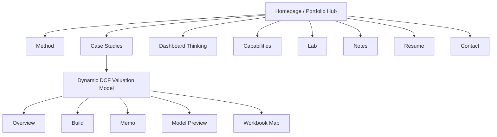

# Site Structure Catalog

Generated from the current static site using the `site-architecture` and `ux-flow` skills.

## Architecture Snapshot

Site type: personal portfolio / case-study hub.

Primary audience: hiring managers and recruiters first; developer and creator peers second.

Primary goals:

- Make Isaiah's positioning clear in the first viewport.
- Route reviewers quickly to proof of work, especially the flagship DCF case.
- Keep future case studies, project lab entries, and notes easy to add without redesigning the site.

## Page Hierarchy

```text
Homepage (/)
+-- Method (#method)
+-- Case Studies (#case-studies)
|   +-- Dynamic DCF Valuation Model (/dcf-model.html)
+-- Dashboard Thinking (#dashboard-thinking)
+-- Capabilities (#capabilities)
+-- Lab (#lab)
+-- Notes (#notes)
+-- Resume (#resume)
+-- Contact (#contact)
```

```text
Dynamic DCF Valuation Model (/dcf-model.html)
+-- Overview (#overview)
+-- Build (#project-architecture)
+-- Memo (#memo)
+-- Model Preview (#model-preview)
+-- Workbook Map (#workbook-map)
+-- Next Step (#case-next-step)
```

## Visual Sitemap



## URL Map

| Page or section | URL | Parent | Nav location | Priority |
| --- | --- | --- | --- | --- |
| Homepage | `/` | none | Header brand, footer | High |
| Method | `/#method` | Homepage | Header, command menu, footer | High |
| Case Studies | `/#case-studies` | Homepage | Header, command menu, footer | High |
| Dynamic DCF Valuation Model | `/dcf-model.html` | Case Studies | Hero CTA, card, command menu, footer | High |
| Dashboard Thinking | `/#dashboard-thinking` | Homepage | Footer | Medium |
| Capabilities | `/#capabilities` | Homepage | Header, command menu, footer | High |
| Lab | `/#lab` | Homepage | Header, command menu, footer | Medium |
| Notes | `/#notes` | Homepage | Command menu, footer | Medium |
| Resume | `/#resume` | Homepage | Header, command menu, footer | High |
| Contact | `/#contact` | Homepage | Header CTA, command menu, footer | High |
| DCF Overview | `/dcf-model.html#overview` | DCF Case | Case header | High |
| DCF Build | `/dcf-model.html#project-architecture` | DCF Case | Case header | Medium |
| DCF Memo | `/dcf-model.html#memo` | DCF Case | Case header | Medium |
| DCF Model Preview | `/dcf-model.html#model-preview` | DCF Case | Case header | High |
| DCF Workbook Map | `/dcf-model.html#workbook-map` | DCF Case | Case header | Medium |

## Navigation Spec

Header nav, homepage: Work, Method, Capabilities, Lab, Resume, with Contact as the rightmost CTA. This keeps the header at five primary items and routes first to evidence.

Header nav, DCF case: Overview, Build, Memo, Model, Workbook, with Portfolio as the return CTA.

Footer nav: grouped secondary navigation for Portfolio, Framework, and Proof. The footer carries links that are useful but too secondary for the header, such as Notes and Dashboard Thinking.

Breadcrumbs: non-root pages use `Home > Case Studies > Current page`. The DCF page is currently the only non-root public page.

## UX Flow

```text
Home entry
+-- Understand positioning in hero
+-- Choose proof path
|   +-- Open DCF case
|   |   +-- Scan overview
|   |   +-- Inspect assumptions and model preview
|   |   +-- Open workbook or template
|   |   +-- Return to portfolio / contact
|   +-- Browse case-study cards
+-- Choose fit path
|   +-- Review method
|   +-- Review capabilities
|   +-- Open resume
+-- Choose exploration path
    +-- Filter lab entries
    +-- Read notes
    +-- Contact / LinkedIn / GitHub
```

## Screen Inventory

| Screen | Primary question answered | Main exit |
| --- | --- | --- |
| Home hero | Who is Isaiah and what kind of work does he do? | DCF case, case files, resume |
| Method | How does he approach ambiguous work? | Case studies |
| Case Studies | What proof exists today? | DCF case, workbook, strategy brief dialog |
| Dashboard Thinking | How does he translate visibility into decisions? | Capabilities |
| Capabilities | What skills back the positioning? | Lab or resume |
| Lab | What is being developed next? | Project brief dialog |
| Notes | What does he believe about the work? | Resume or contact |
| Resume | What is the professional summary? | Resume PDF |
| Contact | How does a reviewer start a conversation? | Email, LinkedIn, GitHub |
| DCF Case | Can a reviewer inspect a real finance artifact? | Workbook, model preview, portfolio return, contact |

## States and Recovery Paths

- Loading: static pages render without a build step; images use lazy loading outside the hero.
- Empty filters: current filter sets all return visible entries. Future filters should keep the live status text and include a reset path.
- Dialog recovery: command and brief dialogs have visible close buttons and close when a selected link is opened.
- Model error recovery: the DCF page exposes integrity checks and a reset control for changed assumptions.
- Navigation recovery: non-root pages have breadcrumbs, a header return CTA, footer links, and at least one in-page return path.

## Reusable Scaffolds

- Case-study spoke: hero, breadcrumb, overview, build notes, memo, interactive artifact, artifact map, next step.
- Homepage hub section: single purpose, one heading, one short supporting paragraph, one primary onward path.
- Footer group: add future routes under Portfolio, Framework, or Proof rather than expanding the header.
